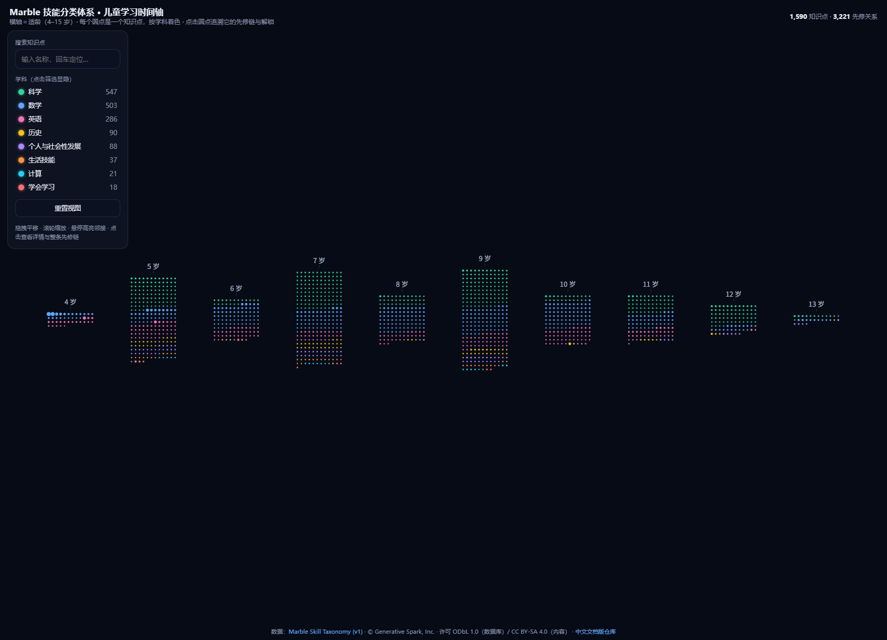
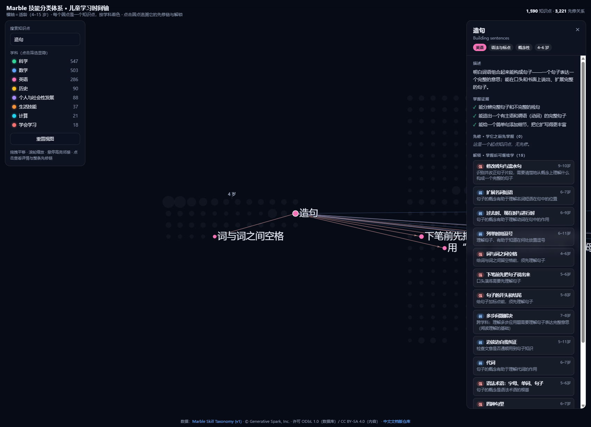

<div align="center">

# 🧭 Structured



> *「What a child should learn, what comes first, and what it unlocks — laid out as one connected map.」*

[](https://shushuitie2017.github.io/structured/)


**1,590 primary-school micro-topics laid out along a 4–15 age timeline — click any one to trace its full prerequisite chain and everything it unlocks. Chinese UI.**

<sub>A connected graph of learning, not another flat list of standards.</sub>

[▶ Live Demo](#-live-demo) · [See it](#-see-it) · [Features](#-features) · [Use the data](#-use-the-data) · [Author](#-author)

[简体中文](README.md) · English

</div>

---

## ▶ Live Demo

### 👉 **<https://shushuitie2017.github.io/structured/>**

No install. Pan, zoom, hover to highlight, click to trace — see where any concept comes from and where it leads.

---

## 🎬 See it

**The x-axis is age (4–15).** Each age is a grid block; taller block = more to learn at that age. Density peaks around 7–9 and tapers off — the shape of the primary-school curriculum at a glance.

<div align="center">

</div>

**Click any topic to trace its full prerequisite chain.** Click "Building sentences" and it lights up the 15 topics it unlocks — a clear growth path fanning out to the right while everything else fades. Names, descriptions, evidence and reasons are all in Chinese (with the English original shown too).

<div align="center">

</div>

> **Not "which topics exist," but "how they chain together."** That's what a DAG gives you that a list can't.

---

## ✨ Features

| | Feature | What it does |
|---|---|---|
| 🗓️ | **Age timeline** | 1,590 topics arranged by age (4–15) into per-age blocks; density visible at a glance |
| 🔗 | **Prerequisite tracing** | Click a topic to recursively highlight its full "must-learn-first" chain |
| 🔓 | **Unlock preview** | See what a topic lets you learn next |
| 🎨 | **Subject coloring** | 8 subjects, each a color; grouped within blocks |
| 🔍 | **Search** | Type a name and hit Enter to locate |
| 🈶 | **Full Chinese content** | Names / descriptions / evidence / reasons all in Simplified Chinese |
| 📦 | **Pure, reusable data** | UTF-8 JSON, no runtime, no deps, with JSON Schemas + a validator |

---

## 📊 What's inside

| Subject | Topics | Subject | Topics |
|---|---:|---|---:|
| 🟢 Science | 547 | 🟡 History | 90 |
| 🔵 Mathematics | 503 | 🟣 Personal & Social Dev. | 88 |
| 🌸 English | 286 | 🟠 Life Skills | 37 |
| 🔷 Computing | 21 | 🔴 Learning to Learn | 18 |

- **1,590 micro-topics** — each a single teachable idea, with a plain-language description, mastery evidence, type, subject + domain, and an age range.
- **3,221 prerequisite edges** — a DAG, each tagged `hard`/`soft` with a one-line reason.
- **Curriculum-aligned** — each topic links to the standards it was distilled from (NGSS, Common Core, the UK National Curriculum, …).

---

## 🛠 Use the data

Pure data — no runtime, no dependencies.

```js
import topics from './data/topics.json' with { type: 'json' };
import deps   from './data/dependencies.json' with { type: 'json' };
import zh     from './data/i18n/zh.json' with { type: 'json' };  // Chinese layer (optional)

const byId = new Map(topics.topics.map(t => [t.id, t]));
const prereqs = deps.dependencies
  .filter(d => d.topicId === 'mt_N8CpN1EJrP')
  .map(d => zh.topics[d.prerequisiteId]?.name ?? byId.get(d.prerequisiteId).name);
```

Validate structure + referential integrity: `node scripts/validate.mjs`

| File | Holds |
|---|---|
| [`data/topics.json`](data/topics.json) | Micro-topics (graph nodes, English original) |
| [`data/dependencies.json`](data/dependencies.json) | Prerequisite edges |
| [`data/i18n/zh.json`](data/i18n/zh.json) | **Chinese content layer**: 1,590 topics + 3,218 reasons |
| [`data/clusters.json`](data/clusters.json) | Parent-friendly domain summaries |

---

## ⚖️ Honest limits

- **Starts at age 4** — the underlying data has no topics below 4, so the timeline starts there.
- **Standards stay English** — `curriculum-standards.json` (third-party) is left verbatim, untranslated.
- **Chinese is a translation** — content is translated from the English source; the detail panel also shows the English original for cross-checking.
- **It describes a typical order, not the only truth** — prerequisites are a sensible teaching sequence, not a rule every child must follow.

---

## 👤 Author

**BlueCat / 蓝猫** — an AI-native builder working on 3D, education and tooling, across Chinese / English / Japanese.

<table>
<tr>
<td width="220" align="center">
<br/>
<sub>👆 WeChat · chat / collab</sub>
</td>
<td>

| | |
|---|---|
| 🐙 GitHub | **[@shushuitie2017](https://github.com/shushuitie2017)** |
| 🧭 This project | [Structured](https://shushuitie2017.github.io/structured/) |
| 💬 WeChat | scan the QR |

</td>
</tr>
</table>

### 🌟 Also building

| Project | One-liner | Live |
|---|---|---|
| 🧒 **BlueCat learns Claude** | An interactive AI primer for kids | [learn.bluecatbot.com](https://learn.bluecatbot.com) |
| 🔧 **HardwareLab** | 3D hardware-teardown teaching, 60fps | [hardware.bluecatbot.com](https://hardware.bluecatbot.com) |
| ⌨️ **MODKEYS** | A 3D custom-keyboard configurator in the browser | [keyboard.bluecatbot.com](https://keyboard.bluecatbot.com) |
| 🎨 **SVGSafe** | A clearly-licensed free SVG icon/illustration library | [svg.bluecatbot.com](https://svg.bluecatbot.com) |

---

## 📜 Data source & license

This is a Chinese edition (docs + a full Chinese content layer + an interactive demo) of an **open dataset**. That dataset is **multi-licensed** — read before use or redistribution:

| Layer | License |
|---|---|
| **The database** (collection, structure, IDs, topic↔topic / topic↔standard relations) | [**ODbL 1.0**](LICENSE) — research & commercial use, **attribution + share-alike** |
| **Textual content** (name / description / evidence / reason / summary, incl. the Chinese translation) | [**CC BY-SA 4.0**](LICENSE-CONTENT) — attribution + share-alike |
| **`curriculum-standards.json`** (third-party) | Each source's own upstream license — see [**PROVENANCE.md**](PROVENANCE.md); untranslated, unchanged |

> **Attribution (required by ODbL / CC BY-SA — must be kept):**
> Marble Skill Taxonomy (v1) · © Generative Spark, Inc. (Marble) · <https://withmarble.com> · licensed under ODbL 1.0 (database) and CC BY-SA 4.0 (content).

The Simplified-Chinese translation (`data/i18n/zh.json`) is a translation of the CC BY-SA content above, released under CC BY-SA 4.0 with attribution preserved. Formal citation: [CITATION.cff](CITATION.cff).

---

<div align="center">

*「Scattered topics, connected into one visible map.」*

**[▶ Open the timeline](https://shushuitie2017.github.io/structured/)**

</div>
